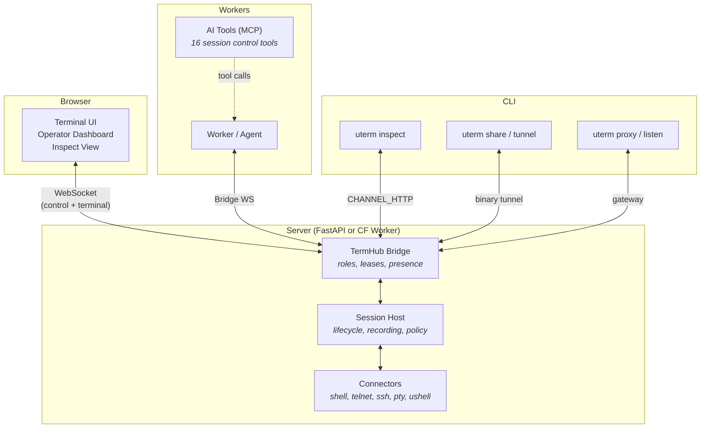
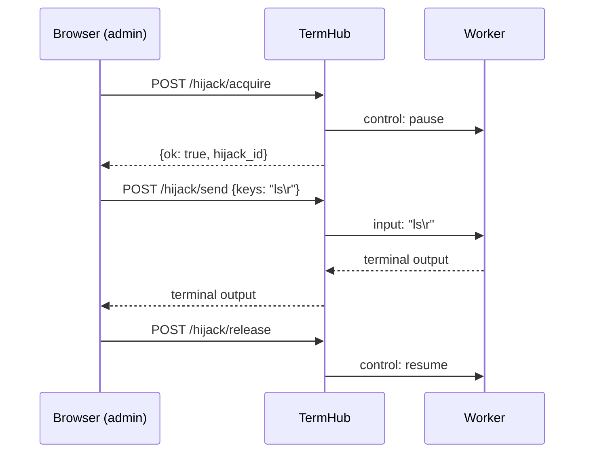
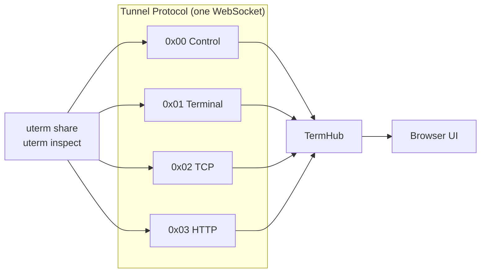
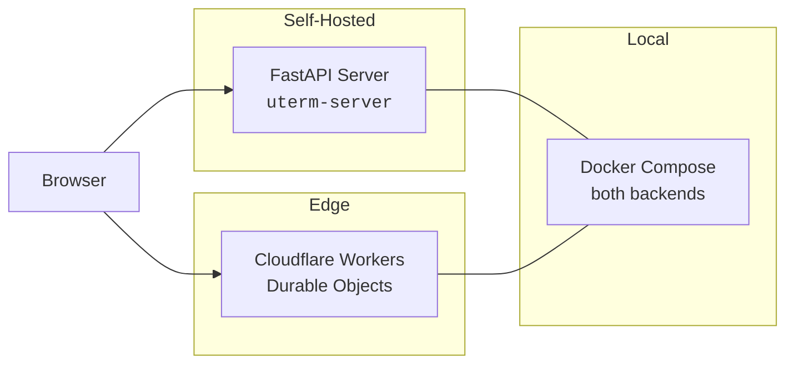

# undef-terminal

A terminal access and control platform. Creates, transports, secures, shares, records, replays, and arbitrates terminal sessions across browsers, WebSockets, telnet, SSH, local PTYs, and remote workers.

> xterm.js is the screen. Undef Terminal is the whole system around the screen.

```
Terminal UI         Session Control       Collaborative Presence
HTTP Inspection     AI/MCP Tools          Tunnel Sharing
Session Replay      Multi-Backend         Agent Management
```

---

## Architecture



**Control channel** — JSON control frames (snapshots, hijack state, presence, analysis) are mixed inline with raw terminal bytes in the same WebSocket stream. This makes the system a session orchestration platform, not just a proxy.

**Session model** — Named sessions with pluggable connectors, lifecycle management, JSONL recording, and policy enforcement.

**Bridge** — TermHub coordinates workers and browsers, enforces viewer/operator/admin roles, manages hijack ownership leases, and supports reconnect/resume tokens.

---

## Quick Start

### Embed a terminal in FastAPI

```python
from undef.terminal.fastapi import mount_terminal_ui
app = FastAPI()
mount_terminal_ui(app)  # serves at /terminal
```

### Run the reference server

```bash
pip install 'undef-terminal[server]'
uterm-server --config server.toml
# Dashboard: http://localhost:27780/app/
```

### Inspect HTTP traffic with interception

```bash
pip install 'undef-terminal[cli]'
uterm inspect 3000 --server https://your-server.example.com --intercept
```

---

## Core Capabilities

### Session Control (Bridge)

The bridge system lets operators observe and take over terminal sessions in real time.

- **Roles** — `viewer` (observe only), `operator` (input in shared mode), `admin` (full hijack control)
- **Hijack leases** — acquire/heartbeat/release with configurable TTL, auto-expire on disconnect
- **Input modes** — `hijack` (exclusive, one owner) or `open` (shared, all operators can type)
- **Session resumption** — browser reconnect restores role and hijack ownership via opaque tokens



### Terminal Transports

Pluggable connectors behind a unified session model:

| Connector | What it does |
|-----------|-------------|
| `shell` | Local shell process |
| `telnet` | Remote telnet (RFC 854) |
| `ssh` | Remote SSH (asyncssh) |
| `websocket` | WebSocket upstream |
| `ushell` | Built-in Python REPL ([undef-terminal-shell](packages/undef-terminal-shell/)) |
| `pty` | Local PTY with PAM auth and LD_PRELOAD capture |

The **gateway** converts between protocols: browser WebSocket ↔ telnet/SSH backends with ANSI color mode negotiation.

### Tunnel Sharing & HTTP Inspection

Share terminals and inspect HTTP traffic through multiplexed binary tunnels.



- **`uterm share`** — share your local terminal through the tunnel server
- **`uterm tunnel`** — forward a local TCP port through the tunnel
- **`uterm inspect`** — HTTP reverse proxy with live traffic inspection
- **`uterm inspect --intercept`** — pause requests, forward/drop/modify from the browser

See [HTTP Inspection & Interception](docs/inspect.md) for the full protocol reference.

### Collaborative Presence (DeckMux)

Real-time collaborative features on any terminal session:

- **Avatar bar** — colored circles with initials, role badges, idle/typing indicators
- **Edge indicators** — minimap-style viewport bars showing where each user is scrolled
- **Pinned cursors** — click a line to pin your position, visible to all watchers
- **Control transfer** — request/handover/auto-transfer with keystroke queue buffering

Enable per-session with `presence: true`. Works on both FastAPI and CF backends at parity.

### AI/MCP Integration

16 tools for AI agents to control terminal sessions via the [Model Context Protocol](https://modelcontextprotocol.io/):

```bash
uterm-mcp  # starts MCP server for Claude, GPT, or any MCP-compatible agent
```

Tools include `session_create`, `session_read`, `session_subscribe`, `hijack_begin`, `hijack_send`, `hijack_step`, `hijack_release`, and more. See [undef-terminal-ai](packages/undef-terminal-ai/).

### Agent Management

Orchestrate fleets of terminal workers:

```bash
uterm-manager --config swarm.yaml
```

Process lifecycle, heartbeat monitoring, auto-respawn, fleet pause/resume, timeseries metrics, and WebSocket status broadcasting. See [undef-terminal-manager](packages/undef-terminal-manager/).

---

## CLI Tools

| Entry Point | Purpose |
|-------------|---------|
| `uterm` | Terminal proxy, sharing, tunneling, inspection |
| `uterm-server` | Hosted reference server with sessions, auth, UI |
| `uterm-mcp` | MCP server for AI agents |
| `uterm-manager` | Agent swarm orchestration |

### `uterm` commands

| Command | Description |
|---------|-------------|
| `proxy HOST PORT` | Browser WS → telnet/SSH proxy |
| `listen WS_URL` | Telnet/SSH client → WebSocket |
| `share [CMD]` | Share local terminal via tunnel |
| `tunnel PORT` | Forward TCP port via tunnel |
| `inspect PORT` | HTTP traffic inspection (add `--intercept` for pause/edit) |
| `watch` | TUI for watching HTTP tunnel traffic |

---

## Installation

```bash
pip install undef-terminal             # core only
pip install 'undef-terminal[cli]'      # CLI tools
pip install 'undef-terminal[server]'   # hosted server
pip install 'undef-terminal[all]'      # everything
```

| Extra | Installs | Required for |
|-------|----------|-------------|
| `[websocket]` | fastapi, websockets | TermHub, WS proxy |
| `[ssh]` | asyncssh | SSH transport |
| `[emulator]` | pyte | Screen state tracking |
| `[server]` | fastapi, uvicorn, pyjwt | Reference server |
| `[cli]` | fastapi, uvicorn, websockets, textual, httpx | CLI tools |
| `[all]` | everything above + fastmcp | Full feature set |

---

## Deployment



**FastAPI** — full control, named sessions, auth, recording, policy. Deploy anywhere Python runs.

**Cloudflare Workers** — edge deployment on [Durable Objects](packages/undef-terminal-cloudflare/) with CF Access JWT, KV session registry, WebSocket hibernation.

**Docker** — both backends locally:
```bash
docker compose -f docker/docker-compose.yml up
# FastAPI: http://localhost:27780/app/
# CF Worker: http://localhost:27788/api/health
```

---

## Package Ecosystem

| Package | Description | Tests |
|---------|-------------|-------|
| `undef-terminal` | Core: bridge hub, server, CLI | 3,000+ |
| `undef-terminal-ai` | AI/MCP integration (16 session control tools) | 189 |
| `undef-terminal-client` | HTTP/WS client library | 88 |
| `undef-terminal-detection` | Prompt detection and screen parsing | 199 |
| `undef-terminal-manager` | Agent swarm management | 579 |
| `undef-terminal-transports` | Telnet, SSH, WebSocket protocols | 408 |
| `undef-terminal-tunnel` | Tunnel protocol, HTTP inspect/intercept | 470 |
| `undef-terminal-gateway` | Protocol conversion (Telnet↔WS, SSH↔WS) | 122 |
| `undef-terminal-pty` | PTY connector, PAM, LD_PRELOAD capture | 192 |
| `undef-terminal-shell` | Python REPL shell (ushell) | 261 |
| `undef-terminal-render` | ANSI color rendering primitives | 97 |
| `undef-terminal-deckmux` | Collaborative presence (Deck Mux) | 177 |
| `undef-terminal-cloudflare` | CF Worker + Durable Object adapter | 886 |
| `undef-terminal-frontend` | Browser UI (vanilla TypeScript) | 472 |

All packages at 100% branch+line coverage. 6100+ tests total.

---

## Security & Quality

- **Auth modes** — `dev` (local), `jwt` (production), fail-closed on misconfiguration
- **Security headers** — CSP, HSTS, X-Frame-Options, SRI integrity hashes (configurable per-header)
- **100% branch coverage** — enforced via `--cov-fail-under=100` in every package
- **Pre-commit** — ruff, mypy strict, ty, bandit, biome (TS/JS) on every commit
- **Security audit** — `pip-audit`, `bandit`, timing-safe token comparison

---

## Docs

- [HTTP Inspection & Interception](docs/inspect.md)
- [Protocol Matrix](docs/protocol-matrix.md) — backend capability contract
- [Testing Guide](docs/TESTING.md)
- [Operations Runbook](docs/operations/runbook.md)
- [Service SLOs](docs/operations/slo.md)
- [Production Readiness Gates](docs/production-readiness-pass2.md)
- [Release Governance](docs/release-governance.md)
- [Architecture Diagrams](docs/diagrams/) (PlantUML)
- [DeckMux Documentation](packages/undef-terminal-deckmux/README.md)
- [Cloudflare Workers](packages/undef-terminal-cloudflare/README.md)

---

## License

AGPL-3.0-or-later. Copyright (c) 2025-2026 MindTenet LLC.
