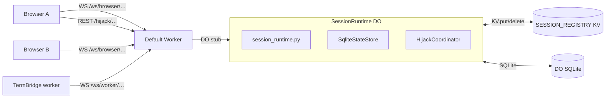
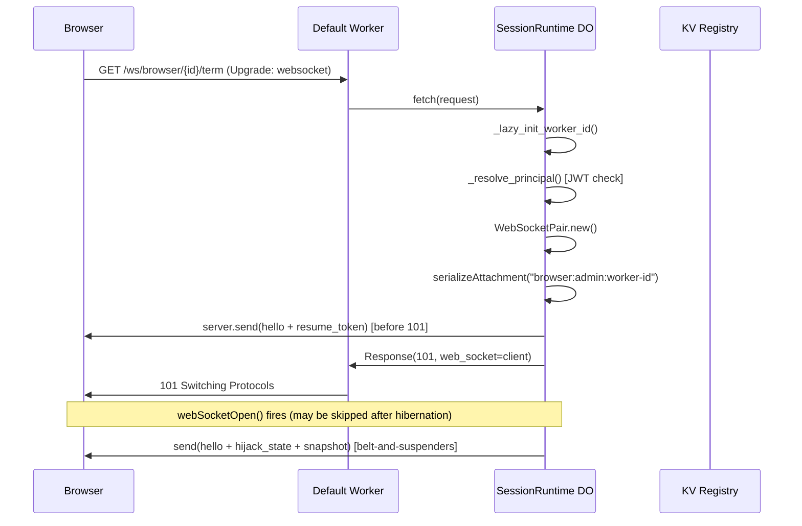
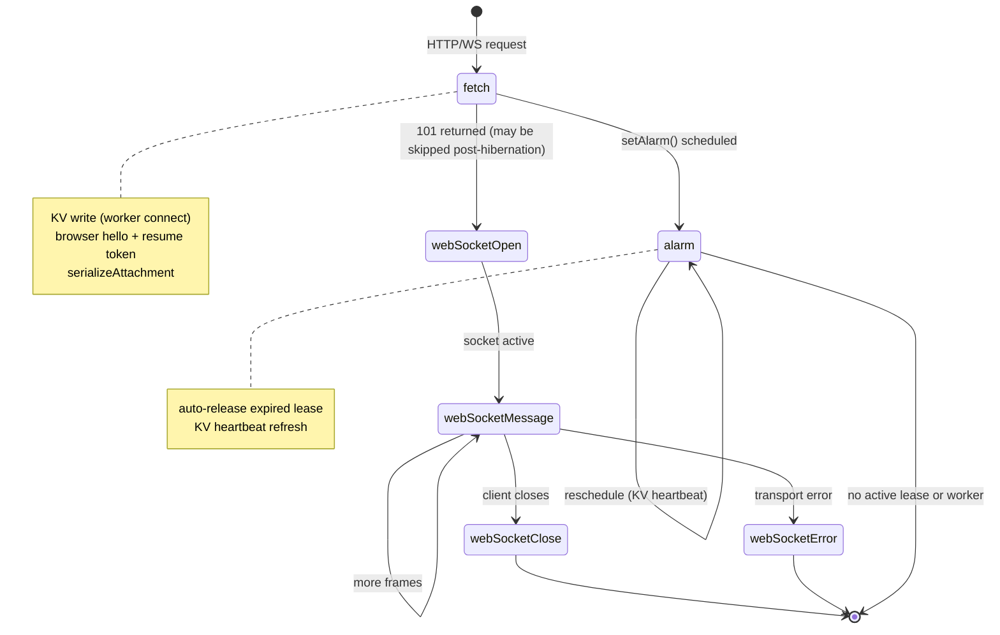
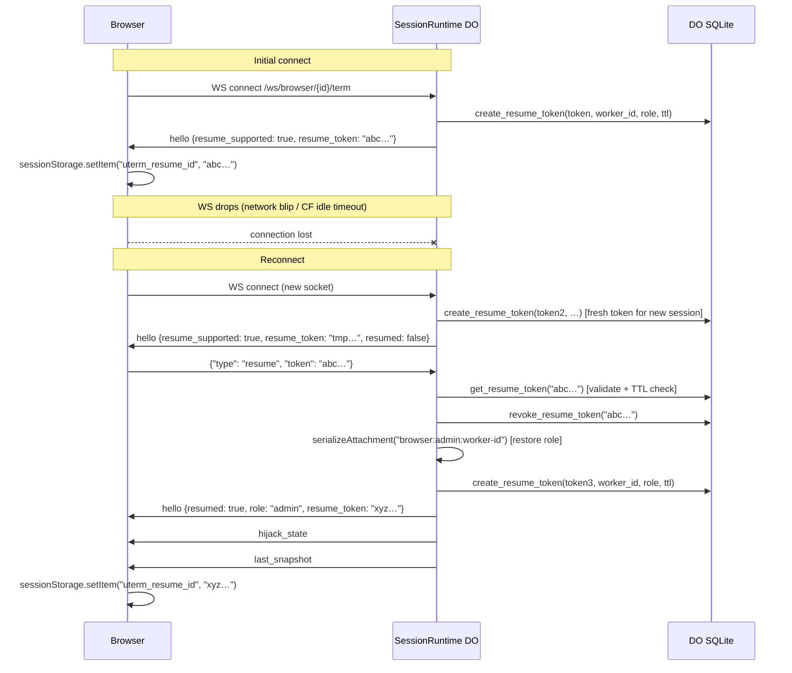

# Cloudflare Durable Object Architecture

## Overview

Each terminal session in the CF deployment runs inside a `SessionRuntime` Durable Object.
The DO acts as the central arbitration point for one worker channel: it holds WebSocket
connections for the runtime worker and any number of browser clients, persists hijack leases
and snapshots in SQLite, and publishes events to all connected browsers.



### Request flow for a browser WS connection



---

## Key Files

| File | Role |
|------|------|
| `do/session_runtime.py` | Main DO class: lifecycle, auth, routing |
| `do/ws_helpers.py` | `_WsHelperMixin`: socket keying, role resolution, send helpers |
| `do/persistence.py` | `persist_lease()` / `clear_lease()` module-level functions |
| `state/store.py` | `SqliteStateStore`: all SQLite I/O |
| `state/registry.py` | `update_kv_session()` / `list_kv_sessions()`: KV fleet registry |
| `api/ws_routes.py` | `handle_socket_message()`: browser/worker frame dispatch |
| `api/http_routes.py` | REST hijack routes (acquire/send/release/step/snapshot) |
| `bridge/hijack.py` | `HijackCoordinator` + `HijackSession` (in-memory lease state) |

---

## Lifecycle: `fetch()` → Hibernation Handlers



CF Hibernation API splits the WS lifecycle across five entry points. Understanding
why logic lives where it does requires knowing when each fires.

### `fetch(request)` — every HTTP/WS request

Called on every inbound request, including WS upgrades. It is the only handler
that runs synchronously before the 101 response is returned to the client.

**Why certain logic lives here instead of `webSocketOpen()`:**

CF can hibernate a DO between any two handler invocations. Async operations
scheduled in `webSocketOpen()` (e.g. `await kv.put(...)`) may be dropped if
the DO hibernates before those coroutines finish. `fetch()` runs within a
single request/response cycle that cannot be interrupted by hibernation.

Consequently:
- **KV worker registration** is written in `fetch()` (not `webSocketOpen()`)
  for worker connections.
- **Browser hello** is sent in `fetch()` via `server.send()` (synchronous,
  before the 101 is returned) rather than in `webSocketOpen()`.

```python
# In fetch():
client, server = WebSocketPair.new().object_values()
ctx.acceptWebSocket(server)
server.serializeAttachment("browser:admin:my-worker-id")
server.send(json.dumps({"type": "hello", ...}))          # sent before 101
return Response(None, status=101, web_socket=client)
```

### `webSocketOpen(ws)` — fires after 101, may not run after hibernation

Used as a secondary registration path. After hibernation, this handler
may fire for connections that were already live before the DO slept.
`_register_socket()` is idempotent (dict assignment), so double-calling
is safe.

For **raw** sockets, `webSocketOpen()` is the only place the last snapshot
is replayed to the new connection (raw sockets don't go through `fetch()`
hello logic).

For **browser** sockets, `webSocketOpen()` sends a second hello + hijack
state + snapshot. This is a belt-and-suspenders path: if `fetch()` failed
to send the hello (e.g. socket closed before `serializeAttachment`), the
client still gets one from `webSocketOpen()`. If `fetch()` already sent it,
the client receives two hellos — the second is harmless (browser ignores
duplicate state).

### `webSocketMessage(ws, message)` — every inbound WS frame

Delegates to `handle_socket_message()` (in `api/ws_routes.py`) for JSON
frames. Raw sockets bypass JSON parsing and push bytes directly to the worker.

### `webSocketClose(ws, code, reason, was_clean)` — socket closed by client or network

**Critical:** After hibernation, `self.worker_ws` is `None` because in-memory
state is reset on wake. Using `ws is self.worker_ws` to identify the worker
socket always returns `False` post-hibernation. Instead, `_socket_role(ws)`
reads the socket's serialized attachment to determine the role.

```python
# WRONG (breaks after hibernation):
if ws is self.worker_ws: ...

# CORRECT:
role = self._socket_role(ws)   # reads deserializeAttachment()
wid  = self._socket_worker_id(ws)
```

### `webSocketError(ws, error)` — transport error

Same role-recovery logic as `webSocketClose()`. Removes the socket and
broadcasts `worker_disconnected` if applicable.

### `alarm()` — scheduled wakeup

Used for two purposes:
1. **Lease expiry**: if the hijack lease `expires_at ≤ now`, auto-release it,
   clear SQLite, push `resume` control to the worker, broadcast hijack state.
2. **KV heartbeat**: if the worker is connected, refresh the KV entry and
   reschedule the alarm at `now + KV_REFRESH_S` (60s). KV entries have no
   `expirationTtl` set (CF Python/Pyodide cannot pass JS kwargs), so the
   alarm heartbeat is what keeps them alive. On worker disconnect, `kv.delete()`
   removes the entry immediately.

---

## Attachment Serialization Format

Every WebSocket accepted by the DO has a `serializeAttachment()` / `deserializeAttachment()`
pair used to encode state that must survive hibernation.

**Format:** `"<socket_type>:<browser_role>:<worker_id>"`

| Field | Values | Example |
|-------|--------|---------|
| `socket_type` | `browser`, `worker`, `raw` | `browser` |
| `browser_role` | `admin`, `operator`, `viewer` | `admin` |
| `worker_id` | arbitrary string | `e2e-abc123` |

Examples:
```
"browser:admin:my-worker-id"
"worker:admin:my-worker-id"
"raw:admin:my-worker-id"
```

`_socket_role()`, `_socket_browser_role()`, and `_socket_worker_id()` all parse
this format. They also handle the legacy plain-string format (`"browser"`, `"worker"`)
for backward compatibility, and fall back to a `ws._ut_role` instance attribute
set in `fetch()` when `serializeAttachment()` raises (rare, but happens in some
test environments).

**Why `worker_id` is in the attachment:**

After hibernation, `self.worker_id` is restored from `ctx.id.name()` — but
that call returns `"default"` in the CF Python runtime for hex-ID-addressed DOs
(a known Pyodide bug). `_socket_worker_id()` extracts the real `worker_id` from
the attachment instead, so `webSocketClose()` / `webSocketError()` can write the
correct KV key on disconnect.

---

## Worker ID Resolution: `_lazy_init_worker_id()`

`ctx.id.name()` always returns `"default"` for name-addressed DOs in the CF Python
runtime (Pyodide). The actual `worker_id` is in the request URL path.

`_lazy_init_worker_id(request)` is called at the top of `fetch()`. It parses the
URL path for known prefixes (`/ws/worker/`, `/ws/browser/`, `/ws/raw/`, `/worker/`,
`/api/sessions/`) and extracts the first path segment after the prefix.

This is a one-time fix-up: once `self.worker_id` is set to a non-`"default"` value,
subsequent calls are no-ops.

---

## In-Memory State vs. SQLite State

The DO keeps both in-memory and SQLite state. They serve different purposes.

| State | In-memory | SQLite |
|-------|-----------|--------|
| `worker_ws` | Current WS handle (lost on hibernation) | — |
| `browser_sockets` | `dict[ws_key, ws]` (lost on hibernation) | — |
| `raw_sockets` | `dict[ws_key, ws]` (lost on hibernation) | — |
| `browser_hijack_owner` | `dict[ws_key, hijack_id]` (lost on hibernation) | — |
| `hijack.session` | `HijackSession` (lease state) | `session_state.hijack_id/owner/expires_at` |
| `last_snapshot` | Latest terminal screen | `session_state.last_snapshot_json` |
| `input_mode` | `"hijack"` or `"open"` | `session_state.input_mode` |
| Resume tokens | — | `resume_tokens` table |
| Event log | — | `session_events` table |

On cold start (after hibernation or eviction), `_restore_state()` reads SQLite and
reconstructs `hijack.session`, `last_snapshot`, and `input_mode`. Active WebSocket
handles cannot be restored from SQLite; they're re-acquired via `ctx.getWebSockets()`
when needed (see `broadcast_to_browsers()`).

---

## SQLite Schema (`SqliteStateStore`)

### `session_state`
One row per worker_id. Upserted via `INSERT … ON CONFLICT DO UPDATE`.

| Column | Type | Description |
|--------|------|-------------|
| `worker_id` | TEXT PK | Session identifier |
| `hijack_id` | TEXT | Active lease ID (NULL if no hijack) |
| `owner` | TEXT | Lease owner string |
| `lease_expires_at` | REAL | Unix timestamp (NULL if no hijack) |
| `last_snapshot_json` | TEXT | JSON-serialized terminal snapshot |
| `event_seq` | INTEGER | Monotonic event sequence counter |
| `input_mode` | TEXT | `"hijack"` or `"open"` |
| `updated_at` | REAL | Unix timestamp of last write |

### `session_events`
Ring buffer of terminal events. Pruned to `max_events_per_worker` (default 2000).
Writes use `SAVEPOINT` for crash atomicity.

| Column | Type | Description |
|--------|------|-------------|
| `worker_id` | TEXT | FK to session_state |
| `seq` | INTEGER | Monotonic sequence number |
| `ts` | REAL | Unix timestamp |
| `event_type` | TEXT | Frame type (`term`, `snapshot`, etc.) |
| `payload_json` | TEXT | Full JSON frame |

### `resume_tokens`
One-time-use tokens for WS session resumption (see [Resume Tokens](#resume-tokens)).

| Column | Type | Description |
|--------|------|-------------|
| `token` | TEXT PK | `secrets.token_urlsafe(32)` |
| `worker_id` | TEXT | Worker this token is bound to |
| `role` | TEXT | Browser role at time of issue |
| `was_hijack_owner` | INTEGER | 1 if browser held hijack when it disconnected |
| `created_at` | REAL | Unix timestamp |
| `expires_at` | REAL | Unix timestamp (TTL enforced on read) |

### Compatibility shim in `_run()`

CF Workers `sql.exec(sql, *params)` takes variadic positional args. Python's
`sqlite3` cursor expects a params tuple. `SqliteStateStore._run()` tries the
variadic form first; if it raises, it falls back to the tuple form. This lets
the same store class run in both the Pyodide runtime and unit tests without mocking.

---

## Fleet Registry: Workers KV

`SESSION_REGISTRY` is a Cloudflare KV namespace. Each DO writes its session
status under `session:{worker_id}`.

- **Write path:** `update_kv_session()`, called from `fetch()` (worker connect)
  and `webSocketOpen()` (secondary) and `alarm()` (heartbeat).
- **Delete path:** `update_kv_session(connected=False)` on worker disconnect.
- **Read path:** `list_kv_sessions()` in the Default Worker's `GET /api/sessions`
  handler (fleet scope). KV is eventually consistent; entries may lag up to ~60s
  globally.
- **No TTL on entries:** CF Python (Pyodide) cannot pass kwargs to `kv.put()` to
  set `expirationTtl`. Entries are removed explicitly on disconnect. The alarm
  heartbeat (every 60s) re-writes the entry while the worker is connected.

---

## Hijack Lease Lifecycle

1. `POST /hijack/{id}/acquire` → `HijackCoordinator.acquire()` creates a
   `HijackSession` in memory, `persist_lease()` writes it to SQLite and schedules
   an alarm at `lease_expires_at`.
2. Browser WS key is recorded in `browser_hijack_owner[ws_key] = hijack_id`.
3. `POST /hijack/{id}/send` → validates owner, calls `push_worker_input()`.
4. `POST /hijack/{id}/release` (or alarm expiry) → `HijackCoordinator.release()`,
   `clear_lease()` NULLs the SQLite row, `push_worker_control("resume")` un-pauses
   the worker.
5. On browser disconnect: `_remove_ws()` clears `browser_hijack_owner[ws_key]`.
   The lease itself remains active — another browser can re-acquire.

---

## Resume Tokens

When a browser connects, `fetch()` creates a resume token in SQLite and includes
it in the hello message. The browser stores it in `sessionStorage`.



On reconnect, the browser sends `{"type": "resume", "token": "…"}` as its first
message. `_handle_resume()` in `ws_routes.py`:

1. Looks up the token in `SqliteStateStore.get_resume_token()` (returns `None`
   if expired or already revoked).
2. Validates `record["worker_id"] == runtime.worker_id` (prevents cross-session replay).
3. Revokes the old token (`DELETE` from `resume_tokens`).
4. Updates the socket's `serializeAttachment` with the restored role.
5. Issues a new token.
6. Sends a `hello` with `resumed: True` + new token + hijack state + snapshot.

Invalid or expired tokens are silently ignored — the browser keeps its fresh
anonymous session from the initial hello.

Token TTL defaults to 300s (5 minutes). Set `resume_ttl_s` in `CloudflareConfig`
to override.

---

## `broadcast_to_browsers()`

After hibernation, `self.browser_sockets` is an empty dict (in-memory state reset).
`broadcast_to_browsers()` calls `ctx.getWebSockets()` as the primary source of
live sockets, falling back to the in-memory dict only if `getWebSockets()` raises.
Each socket's role is re-checked via `_socket_role()` (attachment) to skip worker
and raw sockets.

---

## Auth Flow

```
fetch(request)
  ├── /ws/worker/…  → compare_digest(token, worker_bearer_token)   [constant-time]
  └── everything else → _resolve_principal(request)
        ├── mode=dev/none → (None, None)  [no auth]
        └── mode=jwt      → decode_jwt() → JWKS fetch → principal or 401
```

`browser_role_for_request()` is called after auth passes to derive the role
from the JWT claim. In `dev`/`none` mode it returns `"admin"` unconditionally.

Worker connections use a shared secret (`WORKER_BEARER_TOKEN`) rather than a JWT.
In `jwt` mode, `from_env()` raises `ValueError` if this secret is not set.

---

## Tunnel Protocol (Terminal Sharing)

The tunnel system enables tmate-style terminal sharing: a local CLI agent (`uterm share`)
connects outbound to the CF edge, sharing a PTY session with remote viewers.

### Tunnel Wire Format

Binary WebSocket frames with a 2-byte header:

```
[1 byte: channel_id] [1 byte: flags] [N bytes: payload]

Channel 0x00: control (JSON)
Channel 0x01: primary data (raw PTY bytes)
Channel 0x02+: additional streams (future)

Flags: 0x00=data, 0x01=EOF
```

### Tunnel Key Files

| File | Role |
|------|------|
| `tunnel/protocol.py` (undef-terminal) | Binary frame encode/decode |
| `tunnel/client.py` (undef-terminal) | Async WebSocket tunnel client |
| `tunnel/pty_capture.py` (undef-terminal) | PTY spawn and attach |
| `tunnel/fastapi_routes.py` (undef-terminal) | FastAPI `/tunnel/{id}` route |
| `cli/share.py` (undef-terminal) | `uterm share` CLI entry point |
| `api/tunnel_routes.py` (CF) | Binary frame handler in DO |
| `api/_tunnel_api.py` (CF) | `POST /api/tunnels`, `GET /s/{id}` handlers |
| `entry.py` (CF) | Route registration for `/tunnel/`, `/s/`, `/api/tunnels` |

### Share URL Authentication

| Layer | Token | Role | Requires Account |
|-------|-------|------|-----------------|
| Share URL | `share_token` in query param | viewer | No |
| Control URL | `control_token` in query param | operator | No |
| CF Access JWT | JWT from CF Access | admin/operator/viewer | Yes |

---

## Known Platform Quirks

| Quirk | Symptom | Fix |
|-------|---------|-----|
| `ctx.id.name()` returns `"default"` | Wrong KV key, wrong worker_id in events | `_lazy_init_worker_id()` extracts from URL |
| `kv.put(key, val, expirationTtl=N)` silently fails | KV entries never expire | Don't set TTL; delete explicitly on disconnect |
| `webSocketOpen()` async ops dropped on hibernation | KV not updated, hello not sent | Move critical writes to `fetch()` before 101 |
| `ws is self.worker_ws` always False after hibernation | Worker close not detected | Use `_socket_role(ws)` from attachment |
| `in-memory browser_sockets` empty after hibernation | Broadcasts go nowhere | Use `ctx.getWebSockets()` in `broadcast_to_browsers()` |
| CF Bot Fight Mode blocks `urllib.request` default UA | E2E HTTP helpers get 403 | Add `User-Agent` header in E2E helpers |
| Pyodide `importlib.resources` broken for bundled text | `FileNotFoundError` on asset load | Use `Path(__file__)` fallback in `assets.py` |
