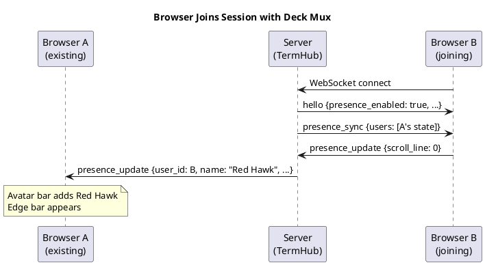
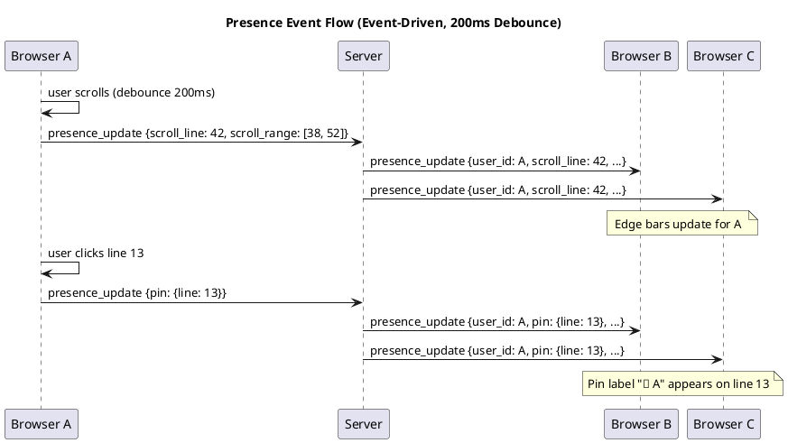
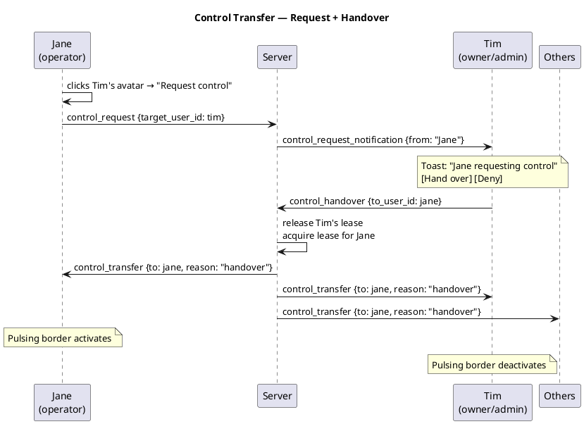
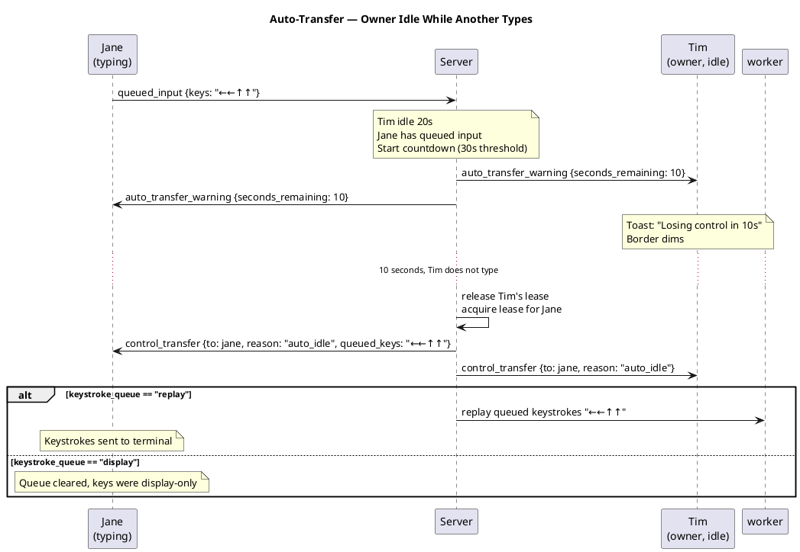
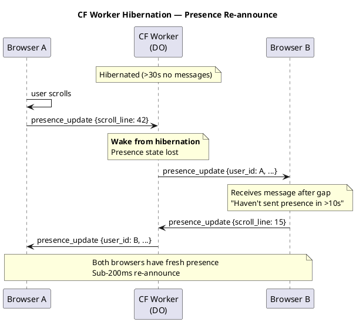

# Deck Mux — Collaborative Terminal Presence

## Goal

Add real-time collaborative presence to terminal sessions: see who's connected, where they're looking, who has control, and transfer control seamlessly. The feature is called **Deck Mux** (DM). It lives in `packages/undef-deckmux/` as a workspace member with zero required dependencies.

## Scope

- **Presence tracking** — avatars, viewport indicators, pinned cursors, selection highlights
- **Control ownership** — visual indicator for who has the keyboard, context menu transfer, auto-transfer on idle
- **Keystroke queue** — buffer and display attempted keystrokes from non-owners
- **Both backends** — FastAPI and CF Worker at parity
- **Per-session** — enabled/disabled per session definition
- **Standalone package** — `undef-deckmux` in the monorepo, integrates with undef-terminal

## Package Structure

```
packages/undef-deckmux/
  src/undef/deckmux/
    __init__.py
    _protocol.py      — message type schemas and constants
    _presence.py       — presence state tracking per session
    _names.py          — deterministic adjective+animal name generator
    _transfer.py       — control transfer rules, auto-transfer, keystroke queue
    _edge.py           — viewport range and scroll position math
  tests/deckmux/
  pyproject.toml       — zero required deps; optional: undef-terminal>=0.4
  VERSION
```

Integration in undef-terminal:
```
packages/undef-terminal/src/undef/terminal/deckmux/
    __init__.py
    _hub_mixin.py      — TermHub mixin wiring DeckMux into broadcast/ownership
```

Frontend:
```
packages/undef-terminal-frontend/src/app/deckmux/
    presence-bar.ts     — avatar bar widget
    edge-indicators.ts  — minimap-style viewport bars
    cursor-overlay.ts   — pinned cursors + selection highlights
    control-panel.ts    — context menu, toasts, auto-transfer UI
    keystroke-queue.ts  — queued keystroke display
```

## Protocol

All messages ride the existing control channel (DLE+STX JSON framing). No new WebSocket endpoints.

### Message Types

**Browser → Server:**

```json
{"type": "presence_update",
 "scroll_line": 42,
 "scroll_range": [38, 52],
 "selection": {"start": {"line": 5, "col": 0}, "end": {"line": 5, "col": 20}},
 "pin": {"line": 13},
 "typing": true}
```

**Browser → Server (keystroke queue):**

```json
{"type": "queued_input", "keys": "←←↑↑→kqs"}
```

**Server → All other browsers:**

```json
{"type": "presence_update",
 "user_id": "abc123",
 "name": "Red Hawk",
 "color": "#2ecc71",
 "role": "viewer",
 "scroll_line": 42,
 "scroll_range": [38, 52],
 "selection": null,
 "pin": {"line": 13},
 "typing": false,
 "queued_keys": ""}
```

**Server → Joining browser:**

```json
{"type": "presence_sync",
 "users": [
   {"user_id": "abc123", "name": "Red Hawk", "color": "#2ecc71", "role": "viewer", ...},
   {"user_id": "def456", "name": "Tim M.", "color": "#e74c3c", "role": "admin", "is_owner": true, ...}
 ],
 "config": {
   "auto_transfer_idle_s": 30,
   "keystroke_queue": "display"
 }}
```

**Server → All browsers (control transfer):**

```json
{"type": "control_transfer",
 "from_user_id": "def456",
 "to_user_id": "ghi789",
 "reason": "handover" | "auto_idle" | "admin_takeover" | "lease_expired",
 "queued_keys": "←←↑↑→kqs"}
```

**Server → All browsers (user leave):**

```json
{"type": "presence_leave", "user_id": "abc123"}
```

### Sequence Diagrams











## Identity

### JWT Users

Extract from JWT claims in order: `name` → `preferred_username` → `email` → `sub`. First non-empty value becomes display name. Initials derived from first two characters of words (e.g., "Tim M." → "TM").

### Anonymous / Dev Mode Users

Deterministic name from connection ID:

```python
ADJECTIVES = ["red", "blue", "green", "amber", "silver", "coral", ...]  # 32
ANIMALS = ["fox", "hawk", "wolf", "otter", "lynx", "crane", ...]       # 32
# hash(connection_id) % 32 → adjective, (hash >> 5) % 32 → animal
# 1024 unique combinations
```

### Color Assignment

Deterministic from user_id hash. Pool of 12 high-contrast colors that work on dark backgrounds. No two users in the same session should get the same color (mod assignment with collision fallback).

## UI Components

### Avatar Bar

Horizontal strip above the terminal. Always visible when presence is enabled.

- Colored circles with 2-letter initials
- Role dot (bottom-right): admin=red, operator=blue, viewer=gray
- Owner: pulsing CSS glow border in their color (pure CSS animation, no emoji)
- Idle: dimmed opacity after 30s no events
- Requesting: yellow border ring
- Click → context menu (name, role, status, jump to view, request control, take control for admins)
- Count badge: "N watching"
- Toggle buttons: "Names" (edge labels), "Cursors" (all visual indicators)

### Edge Indicators (minimap style)

Right edge of terminal, inside an 8px track.

- Each user gets a colored range bar showing their viewport (scroll_range)
- Owner gets a thicker (12px) bar with glow
- Selection = brighter segment within the range bar
- Pin = small bright dot at the pinned line position
- Name labels: hidden by default, shown when "Names" toggle is on or on hover
- Idle users: dimmed bar (opacity 0.2)
- Scales to 20+ users without clutter

### Pinned Cursors

Inline on terminal text at the pinned line.

- Colored vertical bar + name label
- Owner's pin shows `⌨️ Name` label with glow
- Non-owner pins show `📌 Name` label
- Stays until user clicks elsewhere or unpins
- Does not fade on idle (intentional markers)

### Selection Highlights

Semi-transparent colored overlay on selected text lines.

- Uses the user's assigned color at 10% opacity
- Visible to all other users
- Brighter segment on their edge bar indicates selection range

### Keystroke Queue Display

When a non-owner types, their keystrokes are buffered and displayed.

- Shown next to their avatar or in a small tooltip below it
- UTF-8 symbols: `←` `→` `↑` `↓` `↵` `⇥` `⌫` `⎋` for special keys, literal chars for printable
- Updates in real-time as they type
- On control transfer: replayed (if `keystroke_queue: "replay"`) or cleared (if `"display"`)
- Max buffer: 256 characters (truncate oldest)

### Control Transfer

**Manual request flow:**
1. Click owner's avatar → "Request control"
2. Owner sees toast: "[Name] requesting control" with Hand over / Deny
3. On handover: pulsing border moves, status bar updates, toast for everyone

**Admin takeover:**
- Admin clicks any user's avatar → "Take control" (red/danger, immediate)
- No request needed, immediate lease transfer

**Auto-transfer:**
- Configurable: `auto_transfer_idle_s` (default 30, 0=disabled)
- Triggers when: owner idle > threshold AND another user is actively sending `queued_input`
- Warning toast at threshold - 10s: "Losing control in 10s"
- If owner types during countdown: reset, owner keeps control
- On transfer: queued keystrokes replayed or displayed per config
- Status bar shows transition: "⌨️ Tim controlling" → "⏱ Tim idle..." → "⌨️ Jane controlling"

**Lease expiry:**
- Existing hijack heartbeat mechanism unchanged
- DeckMux extends it with presence-aware auto-transfer

## Session Configuration

```python
# In SessionDefinition
presence: bool = False                          # Enable Deck Mux for this session
auto_transfer_idle_s: int = 30                  # 0 = disabled
keystroke_queue: Literal["display", "replay"] = "display"
```

Quick-connect (`POST /api/connect`) accepts these in the payload.

The `hello` message includes `presence_enabled`, `auto_transfer_idle_s`, and `keystroke_queue` so the frontend knows how to initialize.

## Hibernation (CF Worker)

Presence is ephemeral — not persisted to WebSocket attachments or KV.

On hibernation wake:
1. First browser to send a message wakes the DO
2. DO broadcasts that message to other browsers
3. Other browsers detect the gap (>10s since last received message)
4. Each re-announces with a fresh `presence_update`
5. Full presence state reconstructed within ~200ms

No ghost users. No stale state. Honest representation of who's actually connected.

## Server-Side State

### PresenceStore (in `_presence.py`)

```python
@dataclass
class UserPresence:
    user_id: str
    name: str
    color: str
    role: str
    scroll_line: int = 0
    scroll_range: tuple[int, int] = (0, 0)
    selection: dict | None = None
    pin: dict | None = None
    typing: bool = False
    queued_keys: str = ""
    last_activity_at: float = 0.0
    is_owner: bool = False

class PresenceStore:
    """Per-session presence state. Not persisted — ephemeral."""

    def update(self, user_id: str, data: dict) -> UserPresence: ...
    def remove(self, user_id: str) -> None: ...
    def get_all(self) -> list[UserPresence]: ...
    def get_sync_payload(self) -> dict: ...
```

### TransferManager (in `_transfer.py`)

```python
class TransferManager:
    """Control transfer logic — extends existing hijack ownership."""

    def request_control(self, from_user: str, target_user: str) -> dict: ...
    def handover(self, from_user: str, to_user: str) -> dict: ...
    def admin_takeover(self, admin_user: str) -> dict: ...
    def check_auto_transfer(self, current_owner: str, idle_s: float, queued_by: str | None) -> dict | None: ...
    def queue_keystroke(self, user_id: str, keys: str) -> None: ...
    def flush_queue(self, user_id: str) -> str: ...
```

### TermHub Integration (in `_hub_mixin.py`)

Mixin that hooks into TermHub's existing methods:

- `on_browser_connect` → send `presence_sync`, announce to others
- `on_browser_disconnect` → broadcast `presence_leave`
- `on_browser_message` → route `presence_update`, `control_request`, `queued_input`
- `on_hijack_change` → broadcast `control_transfer`
- Periodic check (piggybacks on existing polling) → auto-transfer evaluation

Does NOT duplicate TermHub's broadcast, role checking, or lease management. Calls existing methods.

## Error Handling

| Condition | Response |
|---|---|
| Presence message on non-presence session | Silently dropped |
| Control request from viewer | Ignored (viewers can't request) |
| Control request when no owner | Auto-grant to requester |
| Auto-transfer with no queued user | No transfer (idle owner keeps control) |
| Keystroke queue overflow (>256 chars) | Oldest chars truncated |
| Invalid presence_update fields | Log warning, drop message |

## Testing

### Unit Tests (`packages/undef-deckmux/tests/`)

- `test_presence.py` — PresenceStore CRUD, sync payload, concurrent updates
- `test_names.py` — deterministic generation, collision avoidance, all 1024 combos unique
- `test_protocol.py` — message serialization/deserialization, all types
- `test_transfer.py` — request, handover, admin takeover, auto-transfer threshold, queue buffer, queue flush, replay vs display
- `test_edge.py` — viewport range calculation, scroll position mapping

### Integration Tests (`packages/undef-terminal/tests/`)

- `test_deckmux_hub.py` — TermHub mixin wiring, presence broadcast through real WS
- `test_deckmux_hibernation.py` — CF Worker wake + re-announce flow
- `test_deckmux_transfer.py` — full transfer flow through TermHub

### E2E Tests (Playwright)

- Multi-browser presence: two pages, verify avatar bar updates
- Pin cursor: click line, verify pin appears on other browser
- Control transfer: request → handover flow across two browsers
- Auto-transfer: idle owner, active requester, verify transfer
- Toggle names/cursors: verify visibility changes

## Files Changed

| File | Action |
|---|---|
| `packages/undef-deckmux/` | **Create** — entire package |
| `packages/undef-terminal/src/undef/terminal/deckmux/` | **Create** — hub integration |
| `packages/undef-terminal-frontend/src/app/deckmux/` | **Create** — frontend widgets |
| `packages/undef-terminal/src/undef/terminal/hijack/hub/core.py` | **Modify** — add DeckMux mixin hook points |
| `packages/undef-terminal/src/undef/terminal/hijack/routes/websockets.py` | **Modify** — route presence messages |
| `packages/undef-terminal/src/undef/terminal/server/models.py` | **Modify** — add presence fields to SessionDefinition |
| `packages/undef-terminal-cloudflare/src/undef/terminal/cloudflare/do/session_runtime.py` | **Modify** — presence routing in DO |
| `pyproject.toml` (root) | **Modify** — add undef-deckmux to workspace members |
| `docs/protocol-matrix.md` | **Modify** — add Deck Mux section |
| `README.md` | **Modify** — mention Deck Mux feature |
